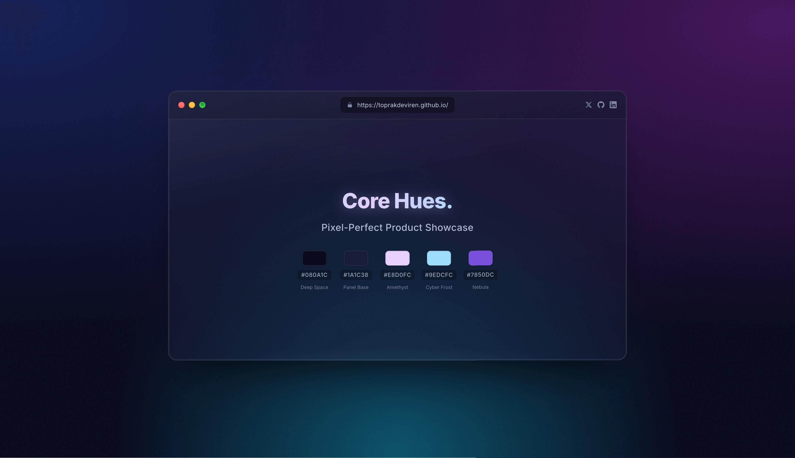

# Polished UI Showcase ✨

A daily commitment to exploring and crafting beautiful, functional UI components. This repository serves as a living portfolio of frontend experiments, design explorations, and the continuous pursuit of pixel-perfect web interfaces.

## 🚀 About This Project

Welcome to my daily UI adventure! Each day (or as often as possible!), I'll be adding a new component, focusing on:

*   🎨 **Aesthetics & Design:** Creating visually appealing and modern user interfaces.
*   ⚙️ **Clean Code:** Writing semantic HTML and efficient, maintainable CSS.
*   💡 **Experimentation:** Trying out new CSS features, animation techniques, and design trends.
*   📚 **Learning & Growth:** Continuously improving frontend development skills.

## 🌟 Current Showcase: Glassmorphic Browser Mockup

The initial component in this series is a sleek, glassmorphic browser window mockup designed to showcase a vibrant color palette.

**Key Features:**
*   Realistic browser UI elements (buttons, address bar).
*   Subtle animations (`windowFloat`, `shimmer` on text, hover effects) for a dynamic feel.
*   Interactive social media icons.
*   A clean display of "Core Hues" with their respective color codes and names.

## Live Demo

Experience the live version of the current component here:
**[https://toprakdeviren.github.io/polished-ui-showcase/](https://toprakdeviren.github.io/polished-ui-showcase/)**

## 🛠️ Built With

*   **HTML5**
*   **CSS3**
    *   Flexbox & Grid for layout
    *   Custom Properties (Variables)
    *   Keyframe Animations & Transitions
    *   Advanced Selectors & Pseudo-elements

## 💬 Connect & Feedback

I'm always open to feedback and suggestions! Feel free to:
*   Open an [Issue](https://github.com/toprakdeviren/polished-ui-showcase/issues) for bugs or feature ideas.
*   Connect with me on [X (Twitter)](https://x.com/@toprakdevos).

---

Happy Coding! 🧑‍💻
